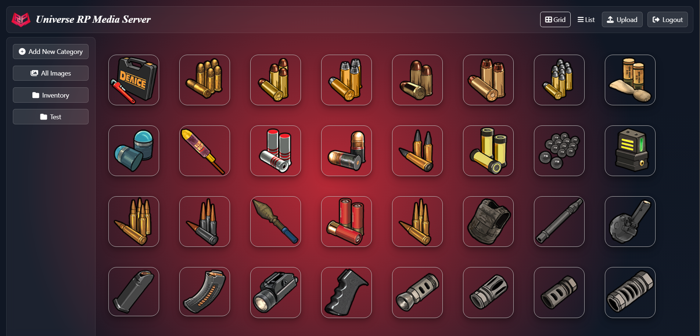
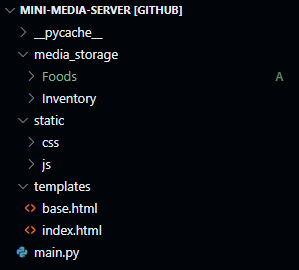

<<<<<<< HEAD
# Media Storage App

A small FastAPI app for managing media categories and uploads, now with simple environment-based authentication.

## Environment variables

Place a `.env` file next to `main.py` (same folder) or set real OS environment variables. See `.env.example` for a template.

Required keys:

- `SESSION_SECRET`: Secret key to sign session cookies. Use a long random string in production.
- `AUTH_USERNAME`: Fixed username allowed to log in (e.g., `admin`).
- `AUTH_PASSWORD`: Fixed password allowed to log in.

## Login & Logout

- Visit `/login` to sign in. After login, you are redirected to the home page.
- Click the Logout button in the header or visit `/logout` to end the session.
- All main routes (`/`, `/upload`, `/create-category/`, `/get_images/{folder}`) require authentication.

## Run locally

Install dependencies and run with Uvicorn (adjust paths as needed):

```cmd
pip install fastapi uvicorn jinja2
uvicorn main:app --reload --port 8000
```

Then open http://localhost:8000 in your browser.

## Notes on "Enable Claude Sonnet 4.5 for all clients"

This repository does not include a model routing layer or feature flags for external LLMs. If you need to enable a specific model (e.g., "Claude Sonnet 4.5") for your clients, please share where that configuration lives (separate service, gateway, or env flags) and we can integrate a toggle or environment-controlled setting here.
=======
# Media Server Software

This repository contains all the necessary files and database needed to set up a fully functional Media Server website built with Python FastAPI.



## Project Overview

The project is a Media Server built using Python, FastAPI, and Jinja2Templating. The software allows you to host media on your own computer and get a direct link to the media by clicking it.

## Project Structure

Below is an image representation of the project structure:



- **media_storage/**: Contains the media files that are hosted on the server.
  - **Foods/**: Directory for food-related media files.
  - **Inventory/**: Directory for inventory-related media files.
  
- **static/**: Contains static files like CSS and JavaScript.
  - **css/**: Contains styles for the website.
    - `styles.css`: Main stylesheet for the site.
  - **js/**: Contains JavaScript files.
    - `script.js`: JavaScript file for website functionality.

- **templates/**: Contains HTML templates for rendering web pages.
  - `base.html`: Base template for the site layout.
  - `index.html`: Homepage of the site.

- **main.py**: The main Python file that runs the FastAPI application.

## License

This project is open source and available under the [MIT License](LICENSE).

## Contributing

Contributions are welcome! If you have improvements or suggestions, feel free to submit an issue or a pull request.

## Contact

If you have any questions or need help setting up the site, feel free to reach out:

- **Email**: [your-email@example.com](mailto:your-email@example.com)
- **GitHub**: [Your GitHub Profile](https://github.com/your-profile)

---

Thank you for using this Media Server software! Feel free to clone, fork, and contribute to improve the experience further.
>>>>>>> 9b7faecfc7ed2af3e63a1a6048d397b0b4ef9927
